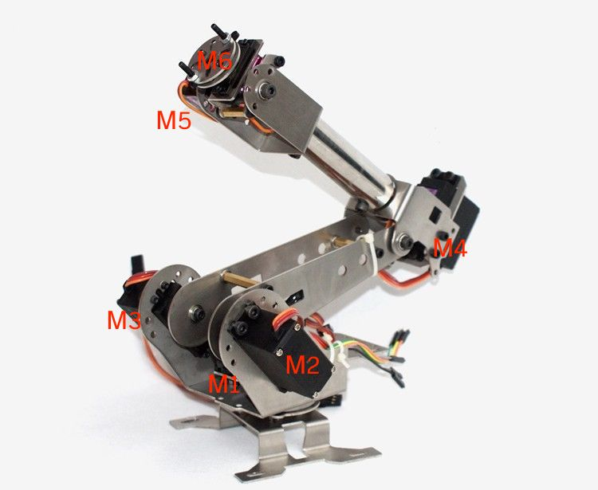

# ARM 6DOF

| Sheild PIN   |      Motor     | Code Mapping |
|----------|:-------------:| ---------:|
| 7 |  M6 | K_END2|
| 8 |    M5   | K_END1|
| 9 | M4 | K_Y|
| 10 | M3 |K_UP2|
| 11 | M2 | K_UP1|
| 12 | M1 |K_BASED|
